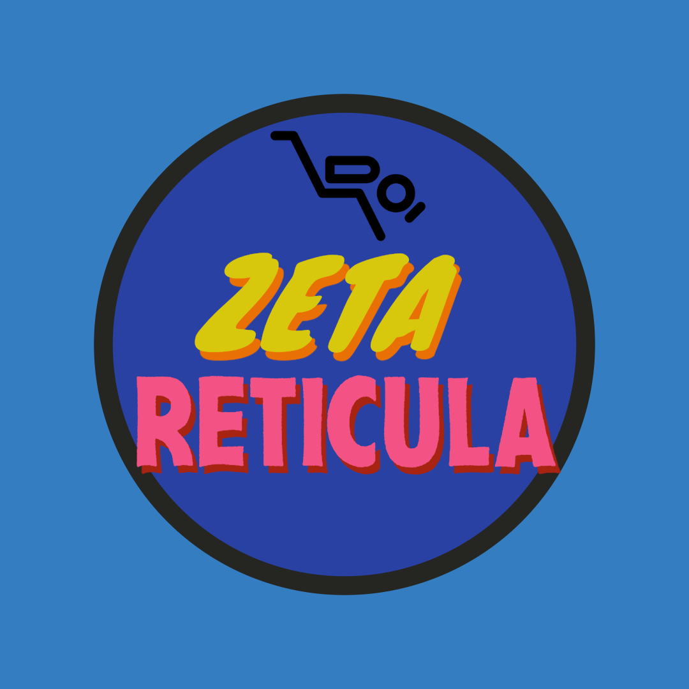

<div align="center">
  <a href="https://github.com/zetareticula/zeta-reticula">
    
  </a>
  
  <h1>Zeta Reticula</h1>
  
  [](https://opensource.org/licenses/MIT)
  [](https://github.com/zetareticula/zeta-reticula/actions)
  [](https://hub.docker.com/r/zetareticula/salience-engine)
  [](https://crates.io/crates/llm-rs)
  [](https://docs.rs/llm-rs)
</div>

> "Precision-engineered intelligence for the next generation of AI applications."

## 🚀 Overview

Zeta Reticula is a high-performance, open-source framework for optimizing large language model (LLM) inference through advanced quantization techniques. Built in Rust for maximum performance and safety, it provides fine-grained control over numerical precision to balance model accuracy, memory usage, and computational efficiency.

The framework is designed from the ground up to support:
- Multiple numerical precisions (1-bit to 32-bit)
- Hardware-accelerated operations
- Memory-efficient model serving
- Scalable distributed inference

## ✨ Features

### 🎯 Precision Control
- **Multiple Precision Levels**: 1-bit, 2-bit, 4-bit, 8-bit, 16-bit (fp16), and 32-bit (fp32) support
- **Mixed Precision Training**: Combine fp16 for activations with fp32 for master weights
- **Quantization-Aware Training**: Maintain model accuracy during quantization

### 🚀 Performance
- **Hardware Acceleration**: Optimized for modern CPUs and GPUs
- **Memory Efficiency**: Up to 32x memory reduction with minimal accuracy loss
- **Low-Latency Inference**: Optimized kernels for fast model serving

### 🛠️ Developer Experience
- **Rust-Powered**: Memory safety without garbage collection
- **Simple API**: Easy integration into existing pipelines
- **Comprehensive Metrics**: Detailed performance and accuracy tracking

## 🛠️ Tech Stack

### Core Crates
- **llm-rs**: Core LLM functionality and model serving
- **kvquant-rs**: Advanced quantization algorithms
- **agentflow-rs**: Agent-based workflow orchestration
- **ns-router-rs**: Neuro-symbolic routing for model execution

### Infrastructure
- **APIs**: Actix-web for high-performance web services
- **Containerization**: Docker + Kubernetes for deployment
- **CI/CD**: GitHub Actions for automated testing and deployment
- **Monitoring**: Prometheus + Grafana for observability

## 🚀 Quick Start

### Prerequisites

- Rust (latest stable, 1.70+ recommended)
- Cargo (Rust's package manager)
- LLVM/Clang (for building some dependencies)
- OpenBLAS or Intel MKL (for optimized math operations)
- CUDA Toolkit (for GPU acceleration, optional)

### Installation

1. Clone the repository:
   ```bash
   git clone https://github.com/zetareticula/zeta-reticula.git
   cd zeta-reticula
   ```

2. Build the project:
   ```bash
   cargo build --release
   ```

3. Run the quantize-cli example:
   ```bash
   cargo run --release --bin quantize-cli -- --help
   ```

### Basic Usage

Quantize a model to 4-bit precision:
```bash
cargo run --release --bin quantize-cli -- quantize \
    --input model.bin \
    --output model_quantized.bin \
    --precision int4
```

Run inference with mixed precision:
```bash
cargo run --release --bin quantize-cli -- infer \
    --model model_quantized.bin \
    --input "Your prompt here" \
    --precision f16
```

### Kubernetes Deployment

Zeta Reticula can be deployed to a Kubernetes cluster using the provided configurations.

#### Prerequisites

1. A running Kubernetes cluster (minikube, EKS, GKE, AKS, etc.)
2. `kubectl` configured to communicate with your cluster
3. `kustomize` installed
4. GPU nodes available in your cluster (for optimal performance)

#### Deployment Steps

1. **Clone the repository**
   ```bash
   git clone https://github.com/zetareticula/zeta-reticula.git
   cd zeta-reticula
   ```

2. **Deploy to Development Environment**
   ```bash
   ./scripts/deploy-k8s.sh --env dev
   ```

3. **Deploy to Production**
   ```bash
   ./scripts/deploy-k8s.sh --env prod
   ```

4. **Verify Deployment**
   ```bash
   kubectl -n zeta-reticula get pods
   kubectl -n zeta-reticula get svc
   ```

5. **Access the API**
   ```bash
   # Get the external IP of the API service
   kubectl -n zeta-reticula get svc api-service
   ```

#### Advanced Configuration

You can customize the deployment by modifying the files in the `k8s/overlays/` directory.

- `k8s/base/` - Base configurations
- `k8s/overlays/dev/` - Development environment overrides
- `k8s/overlays/prod/` - Production environment overrides

#### Monitoring and Logs

```bash
# View logs for all pods
kubectl -n zeta-reticula logs -l app=zeta-reticula --tail=50

# View metrics (if enabled)
kubectl -n zeta-reticula port-forward svc/grafana 3000:3000
```

### Local Development

1. **Clone & Build**
   ```bash
   git clone https://github.com/zetareticula/zeta-reticula.git
   cd zeta-reticula
   cargo build --release
   ```

2. **Run with Docker**
   ```bash
   docker-compose up --build
   ```
   Access the API at `http://localhost:8080`

### 🚀 Production Deployment

#### Kubernetes (Helm)

```bash
# Add Helm repo
helm repo add zeta https://charts.zeta-reticula.ai

# Install chart
helm install zeta zeta/zeta-reticula -n zeta --create-namespace
```

## 📚 Documentation

- [API Reference](https://docs.zeta-reticula.ai/api)
- [Deployment Guide](https://docs.zeta-reticula.ai/deployment)
- [Developer Guide](https://docs.zeta-reticula.ai/development)

## 🤝 Contributing

We welcome contributions! Please read our [Contributing Guide](CONTRIBUTING.md) to get started.

## 📄 License

This project is licensed under the MIT License - see the [LICENSE](LICENSE) file for details.

## 🌐 Community

- [Discord](https://discord.gg/your-invite)
- [Twitter](https://twitter.com/zetareticula)
- [Blog](https://blog.zeta-reticula.ai)

---

<div align="center">
  Made with ❤️ by the Zeta Reticula Team
</div>


   ```

3. **Set Up the Front-End**

   ```bash
   cd app
   npm install
   npm start
   ```

Visit `http://localhost:3000` to explore the dashboard and begin your journey into optimized inference!

### Troubleshooting

#### Docker Build Issues

- **Missing Dependencies**: Ensure all build dependencies are installed in the Dockerfile.
  ```dockerfile
  RUN apt-get update && apt-get install -y \
      pkg-config \
      libssl-dev \
      build-essential \
      cmake \
      curl \
      git \
      clang \
      lld \
      protobuf-compiler \
      libprotobuf-dev \
      && rm -rf /var/lib/apt/lists/*
  ```

- **Rust Version Mismatch**: Ensure the Rust version in the Dockerfile matches the required version for all dependencies.
  ```dockerfile
  FROM --platform=linux/amd64 rust:1.82-slim-bookworm AS builder
  ```

#### Kubernetes Issues

- **Image Pull Errors**: Ensure the image is available in your cluster. For local development, use `kind` to load the image:
  ```bash
  kind load docker-image zeta-salience/salience-engine:local --name your-cluster-name
  ```

- **Service Not Accessible**: Check if the service is running and the ports are correctly exposed:
  ```bash
  kubectl -n zeta get svc,pods
  kubectl -n zeta logs -l app=zeta-reticula,component=salience-engine
  ```

#### Common Build Errors

- **Protoc Not Found**: Ensure `protobuf-compiler` is installed:
  ```bash
  sudo apt-get install -y protobuf-compiler
  ```

- **Rust Toolchain Issues**: Ensure the correct Rust toolchain is installed:
  ```bash
  rustup update
  rustup default stable
  ```

For additional help, please open an issue on our [GitHub repository](https://github.com/your-org/zeta-reticula/issues).

---

## Directory Structure

```
zeta-reticula/
├── app/              # React-based front-end UI/UX
├── api/              # Rust-based API server
├── llm-rs/           # Core inference engine
├── salience-engine/  # Salience-driven quantization
├── ns-router-rs/     # Neural network routing
├── kvquant-rs/       # KV cache quantization
├── quantize-cli/     # Command-line interface
├── agentflow-rs/     # Federated learning framework
├── README.md         # This file
└── LICENSE           # Open-source license (e.g., MIT)
```

---

## Contributing

As we venture into this new epoch of artificial intelligence, we invite bold pioneers to contribute. Fork the repository, submit pull requests, and join our community to shape the future of inference quantization. Issues and feature requests are welcome—let’s build a Time Machine for the mind together!

- **Issues**: Report bugs or suggest enhancements [here](https://github.com/your-org/zeta-reticula/issues).
- **Code Style**: Adhere to Rust and JavaScript best practices.
- **Communication**: Engage with us via our [Discord server](https://discord.gg/your-invite-link).

---

## Roadmap

- **Q3 2025**: Integrate WebSockets for real-time metric streaming.
- **Q4 2025**: Expand support for homomorphic encryption and dynamic client allocation.
- **Q1 2026**: Launch enterprise-grade features like multi-tenant support and advanced visualization tools.

---

## License

This project is licensed under the MIT License—free to use, modify, and distribute, as we propel humanity into the stars of computational innovation.

---

## Contact

Embark on this odyssey with us! Reach out at [karl@zetareticula.com](mailto:karl@zetareticula.com) or follow our journey on [Twitter](https://twitter.com/ZetaReticulaAI).

"Into the abyss of the future we go, where machines dream and humanity ascends!" — H.G. Wells, rekindled.

🌠 **Zeta Reticula: Quantizing the Infinite, Today!** 🌠
