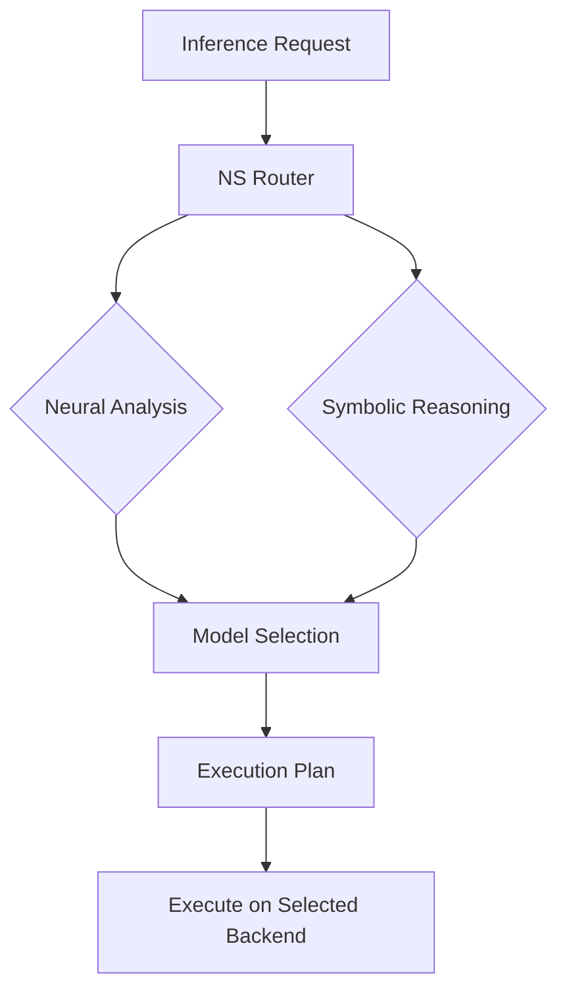

# NS Router

A neurosymbolic router for inference requests that combines neural and symbolic approaches to optimize model selection and execution strategy in the Zeta Reticula ecosystem.

## Features

- **Neurosymbolic Routing**: Combines neural networks with symbolic reasoning for optimal request routing
- **Dynamic Model Selection**: Chooses the best model based on input characteristics and available resources
- **KV Cache Management**: Efficiently manages key-value caches for transformer models
- **Context-Aware**: Takes into account user context and system state when making routing decisions
- **Extensible**: Easy to add new models and routing strategies

## Architecture



## Quick Start

### Prerequisites

- Rust 1.70+
- Cargo
- (Optional) Kubernetes for deployment

### Running Locally

```bash
# Clone the repository
git clone https://github.com/zetareticula/zeta-reticula.git
cd zeta-reticula/ns-router-rs

# Build in release mode
cargo build --release

# Run the router
cargo run --release --example basic
```

### Kubernetes Deployment

Deploy the NS Router to your Kubernetes cluster:

```bash
# Make the deployment script executable
chmod +x ../../scripts/deploy_ns_router.sh

# Deploy
./scripts/deploy_ns_router.sh
```

## Configuration

The router can be configured using environment variables or a configuration file:

```toml
# Example config.toml
[server]
port = 8080
log_level = "info"

[routing]
default_model = "llama2-7b"
max_concurrent_requests = 100

[cache]
enabled = true
size_mb = 1024
```

## API Reference

### POST /v1/route

Route an inference request to the appropriate model.

**Request:**
```json
{
  "prompt": "Your input text here",
  "user_id": "user123",
  "preferences": {
    "max_tokens": 100,
    "temperature": 0.7
  }
}
```

**Response:**
```json
{
  "model": "llama2-7b",
  "execution_strategy": "local",
  "kv_cache_config": {
    "enabled": true,
    "size_mb": 512
  },
  "symbolic_rules": ["rule1", "rule2"]
}
```

## Integration with Other Components

The NS Router works with:

- **kvquant_rs**: For optimized model execution
- **p2pstore**: For distributed model storage
- **AgentFlow**: For workflow orchestration
- **zeta-vault-synergy**: For secure model access

## Performance

Typical performance characteristics:

- Latency: < 10ms for routing decisions
- Throughput: 10,000+ requests/second
- Memory: ~100MB baseline

## Monitoring

Metrics are exposed in Prometheus format at `/metrics`:

```
# HELP ns_router_requests_total Total number of requests processed
# TYPE ns_router_requests_total counter
ns_router_requests_total{status="success"} 42
ns_router_requests_total{status="error"} 1
```

## Contributing

Contributions are welcome! Please see the main [CONTRIBUTING.md](../../CONTRIBUTING.md) for guidelines.

## License

This project is licensed under the MIT License - see the [LICENSE](../../LICENSE) file for details.
